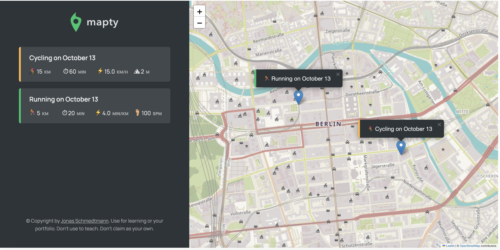

# 📍 Mapty: Track Your Workouts

Mapty is an interactive web application to record your workouts on a map. Whether you're cycling or running, Mapty will keep a record of your adventures and physical accomplishments.

## 🎯 Features:

1. **GeoLocation**: Automatically captures user's current location when the app loads.
2. **Interactive Map**: Users can click on the map to log a new workout at that location.
3. **Workout Types**: Supports two types of workouts:
    - **Running**: Log the distance, duration, and cadence.
    - **Cycling**: Record the distance, duration, and elevation gain.
4. **Workout List**: Displays a list of all workouts on the side with essential details.
5. **Popup Markers**: Each workout has a marker on the map that displays a popup with the workout details.
6. **Local Storage**: Workouts are saved to local storage, so they persist across page loads.
7. **Form Interaction**: Dynamic form fields based on the type of workout (Running or Cycling).

## 🧠 JavaScript Concepts Learnt:

1. **Object-Oriented Programming (OOP)**: Used classes to model real-world objects (workouts) and organize related data and behaviors.
2. **GeoLocation API**: Leveraged the browser's GeoLocation API to get the user's current position.
3. **Leaflet Library**: Used the Leaflet library for rendering interactive maps and markers.
4. **Event Handling**: Attached event listeners to various DOM elements and managed user interaction.
5. **Local Storage**: Stored and retrieved data from the browser's local storage.
6. **Form Handling**: Managed form input fields, validation, and dynamic toggling of fields.
7. **Data Modeling**: Modeled data with parent and child classes using inheritance.

---
